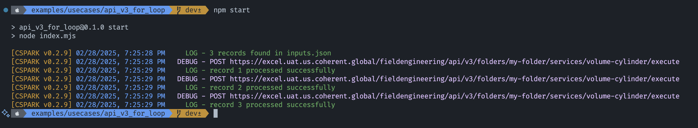

## Execute Records Sequentially using Execute APIv3

This execution is based on [Execute APIv3][exec-v3] and uses a for-loop approach to submit
each record individually and sequentially. Benefits of running this type of iteration
include the generation of a call ID for each API call, which can be used to retrieve
a detailed log of the execution.

This example also assumes that the data is coming from an [inputs.json](inputs.json)
data file and will output the results to an `outputs.json` file, both in JSON format.
Every API call will be logged to the console.

> **Note**: This example can be used in hybrid deployments as well.

## Running the Example

To run this use case, replace the placeholder values with your own in [index.js](index.js):

- `sourcePath`: Path to the data file (change the file name if needed)
- `outputPath`: Path to save the output file (change the file name if needed)
- `baseUrl`: Base URL of the Coherent Spark instance
- `token`: Bearer token to authenticate the API calls (see [Authentication](../../../docs/authentication.md))
- `serviceUri`: Locate which service to execute (e.g., folder and service name)

Then, run the following command:

```bash
npm start
```

The execution will begin, with logs being recorded in the `console` and the
results will be saved to the `outputs.json` file, as illustrated below:

[](outputs.json)

## What's Next

This should be a good starting point to understand how to execute multiple inputs
sequentially using [Execute APIv3][exec-v3]. You might want to adjust the code to
fit your specific needs. However, consider using another approach (e.g.,
[Execute Sync Batch of Records using Execute APIv4](../api_v4_sync_batch/readme.md))
if you need to process a larger number (e.g., 1,000+) of records or synchronous calls.

<!-- References -->

[exec-v3]: https://docs.coherent.global/spark-apis/execute-api/execute-api-v3
