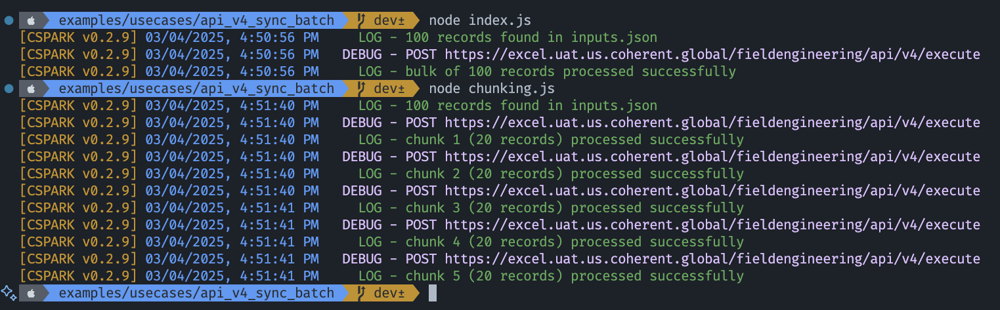

## Execute Sync Batch of Records using Execute APIv4

This execution is based on [Execute APIv4][exec-v4] and will process a bulk of records
in a single API call.
This approach is more efficient than [Executing Records Sequentially using Execute APIv3][exec-v3-for-loop]
as it reduces the number of API calls and improves the overall performance in terms of travel time.
However, there's only one call ID generated for the entire bulk, which means, an
indexing mechanism is needed to track individual records and rehydrate logs into
Excel files. Additionally, you might have to adjust the SDK client timeout based on
the record count and size.

This example also assumes that the data is coming from an [inputs.json](inputs.json)
data file and will output the results to an `outputs.json` file, both in JSON format.
If you're using CSV data, take a look at the [csv.js](csv.js) file for an example
of how to read and process CSV files.

> **Note**: This example can be used in hybrid deployments as well.

## Running the Example

To run this use case, replace the placeholder values with your own in [index.js](index.js):

- `sourcePath`: Path to the data file (change the file name if needed)
- `outputPath`: Path to save the output file (change the file name if needed)
- `baseUrl`: Base URL of the Coherent Spark instance
- `token`: Bearer token to authenticate the API calls (see [Authentication](../../../docs/authentication.md))
- `serviceUri`: Locate which service to execute (e.g., folder and service name)

Then, run the following command:

```bash
npm start
```

The execution will begin, with logs being recorded in the `console` and the
results will be saved to the `outputs.json` file, as illustrated below:

[](outputs.json)

## What's Next

In scenarios where you need to process a larger volume of records (e.g., 1,000),
the timeout limitations of Spark servers, which is approximately 55 seconds per API call,
may require you to divide the records into smaller batches and process them sequentially.
In such cases, consider employing more advanced techniques to manage the processing
efficiently.

The [chunking.js](chunking.js) file is an example of how to chunk the records read from
the data file and process them sequentially using a for-loop approach.

<!-- References -->

[exec-v3-for-loop]: ../api_v3_for_loop/readme.md
[exec-v4]: https://docs.coherent.global/spark-apis/execute-api/execute-api-v4
